 

## About me

- 🚋 I build **[Tramway](https://github.com/Purple-Magic/tramway)** — an opinionated toolkit for spinning up production-ready Rails apps fast, plus the engines and admin panel around it
- 🟣 I run **[Purple Magic](https://github.com/Purple-Magic)** — a small studio shipping client APIs, bots, and Rails products
- 🤖 I write Claude Code skills (`tramway-skill`, `kamal-deploy-skill`, `dip-skill`, `skillyaga`) so agents can generate Rails code the way I'd write it myself
- 📰 I publish the [IT History Journal](https://history.purple-magic.com) — a project documenting the history of computing and IT
- 📍 Based in Batumi, Georgia
- ✍️ I write about dev tooling on [Medium](https://kalashnikovisme.medium.com)

## Projects I'm proud of

| Project | Description |
|---|---|
| 🚋 **[Tramway](https://github.com/Purple-Magic/tramway)** | Start your Rails project with Tramway — opinionated toolkit + engines + admin panel |
| 🟣 **[Purple Magic](https://github.com/Purple-Magic)** | Studio building client APIs, bots, and Rails products |
| 📰 **[IT History Journal](https://history.purple-magic.com)** | Documenting the history of computing and IT ([source](https://github.com/kalashnikovisme/it_history_journal)) |
| 🖥️ **[dotfiles](https://github.com/kalashnikovisme/dotfiles)** | Install my dev environment with one command |
| 🎞️ **[nano-metadata](https://github.com/kalashnikovisme/nano-metadata)** | Get the duration of a video file in the browser |

## Tech I work with

## GitHub stats

